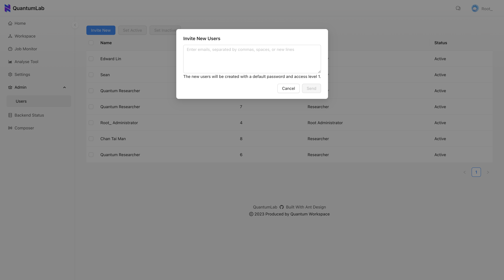

# QuantumLab

<!-- ABOUT THE PROJECT -->
## About This Project

QuantumLab is an open-source quantum computing platform aiming to enhance researchers' experience by gathering the access to quantum computing resources from multiple providers. In addition, QuantumLab provides customisable analysis and visualisation tool based on [Apache-Superset](https://superset.apache.org/docs/intro) for quantum circuit execution results.

<!-- BUILT WITH -->
## Built With


<!-- PROJECT STRUCTURE -->
## Project Structure
```sh
QuantumLab                                                
├─ api                  # Backend API endpoints
├─ bootstrap            # Env bootstrap
├─ cluster              # Kubernetes cluster
├─ cmd                  # Backend entrypoint
├─ docs                 # Documents
├─ internal             # Backend internal utils
├─ model                # Backend data model
├─ repository           # Backend data repository
├─ usecase              # Backend usscase (Business logic)
├─ website              # Frontend code
├─ DOCKERFILE           # Dockerfile for building docker image
├─ go.mod
├─ go.sum
├─ LICENSE
├─ README.md
```

<!-- GETTING STARTED -->
## Getting Started

### Prerequisite
Make sure you properly installed **Go 1.20** on your OS. Refer to the [Go official documentation](https://go.dev/doc/install) for more details.

### Install dependencies
Note: Make sure you execute all following commands from the root project directory.
```
go get ./...
```

### Configure `.env` file
Several environment variables need to be set up before developing this repository. An example `.env` file is provided ([.env.example](.env.example)), and you may need to replace these example values environment variables. The `.env` file must be put in the root project directory for development.

### Run server program
```
go run cmd/main.go
```

### Swagger
Install swag CLI:
 ```
 go install github.com/swaggo/swag/cmd/swag@latest
 ```

 Create or update swagger API documentation:
 ```
 swag init -g ./cmd/main.go ./docs --pd true
 ```
 You can visit the API documentation after starting up the server: http://localhost:8080/swagger/index.html#/

<!-- SYSTEM USERS -->
## System Users

### System roles

By default, the system has the following three different roles:

| id | name |
| -- | ---- |
| 0 | Root Administrator |
| 1 | Administrator |
| 2 | Researcher |

### Initialise Root Administrator

Navigate to the following page to initialise the Root Administrator if the system has not had any user yet:
http://localhost:8000/admin/adminInitialization.

### Invite researchers

Login as an Administrator, hit this link (http://localhost:8000/admin/users) and click on the "Invite New" button to invite new users with the Researcher role. The login credential will be sent to the email address entered.




<!-- LICENSE -->
## License

Distributed under the MIT License. See [LICENSE.txt](LICENSE.txt) for more information.
